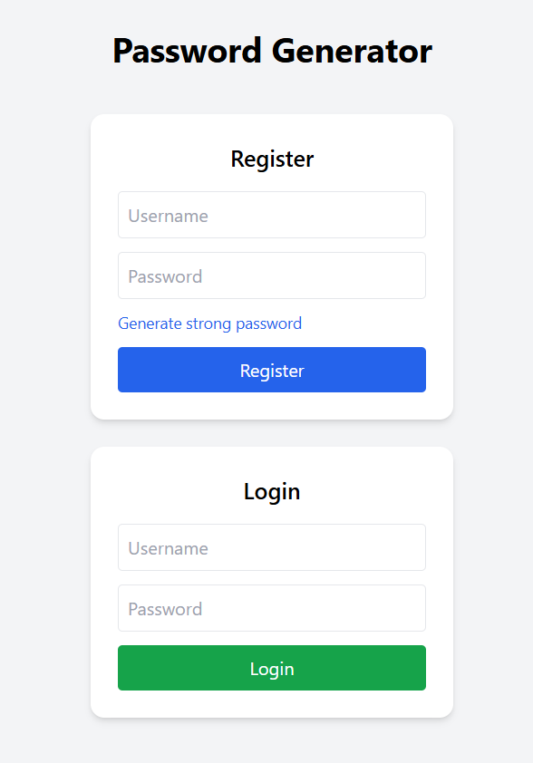
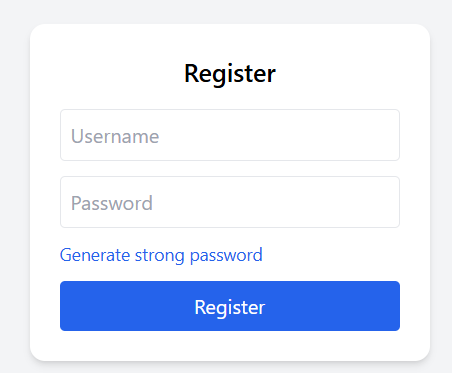
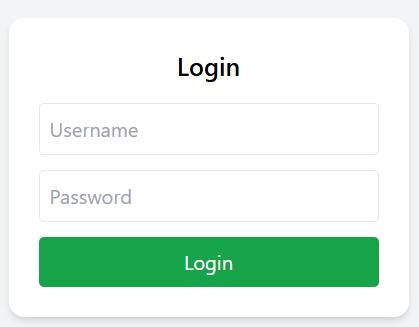
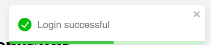
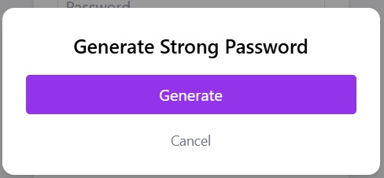
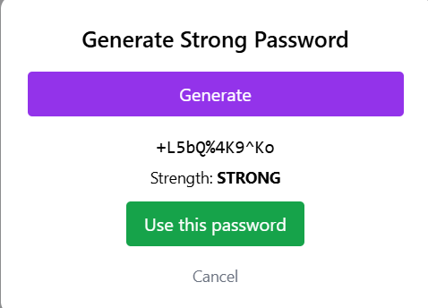

# 🔐 **Password Generator & Authentication System**

A full-stack, production-style password management application built using Spring Boot, JWT-based authentication, MySQL, and a React + Tailwind CSS frontend.

This project demonstrates secure password handling, modern authentication practices, and clean frontend–backend integration.

## **🚀 Features**

### **✅ Authentication & Security**

User registration & login

Passwords hashed securely (never stored in plain text)

JWT-based authentication

Industry best practices for credential handling

### **🔑 Password Generation**

Strong password generator

Configurable rules:

Uppercase letters

Lowercase letters

Numbers

Symbols

Password strength evaluation (WEAK / MEDIUM / STRONG)

Generator integrated directly into user registration flow

### 🎨 **Frontend (React + Tailwind)**

Clean, modern UI

Responsive design

Password strength indicator

Toast-style feedback (success / errors)

Secure API communication with backend

### ****🗄️ Database****

MySQL integration

JPA + Hibernate

User persistence with hashed passwords

### **🛠️ Tech Stack**

Backend

Java

Spring Boot

Spring Security

JWT (JSON Web Tokens)

Spring Data JPA

MySQL

Frontend

React (Vite)

Tailwind CSS

Fetch API

## 🏗️ **Project Architecture**

#### **Backend (Spring Boot)**

├── controller     → REST APIs
├── service        → Business logic
├── model          → DTOs & entities
├── security       → JWT, hashing, verification
├── repository     → Database access
└── exception      → Global exception handling

#### **Frontend (React)**

│
├── components
│   ├── Register.jsx
│   ├── Login.jsx
│   └── PasswordGenerator.jsx
├── App.jsx
└── Tailwind styling

## **🔌 API Endpoints**

**### 🔐 Authentication**

| Method | Endpoint                 | Description       |
| ------ | ------------------------ | ----------------- |
| POST   | `/api/password/register` | Register new user |
| POST   | `/api/password/login`    | Login user        |

### **🔑 Password Generation**

| Method | Endpoint                 | Description              |
| ------ | ------------------------ | ------------------------ |
| POST   | `/api/password/generate` | Generate strong password |
| GET    | `/api/password/health`   | Health check             |

## **🖥️ Screenshots**

### User View

### User Registration

### Successful Registration

### Login

### Successful Login

### Password Generator

### Generated Password

## **▶️ How to Run Locally**

Backend

cd PasswordGenerator
./mvnw spring-boot:run

Frontend

cd password-generator-ui
npm install
npm run dev

Frontend runs on:

http://localhost:5173

Backend runs on:

http://localhost:8080

**## 🔒 Security Highlights**

No plaintext password storage

Password hashing + verification

JWT validation on protected routes

Separation of concerns (controller/service/security)

Scalable architecture

## **📌 Future Enhancements**

Role-based access (ADMIN / USER)

Password history tracking

Rate limiting

Deployment (Docker + AWS)

Email verification

## **👨‍💻 Author**

Kaustubh Mali

Software Engineer | Backend & Full Stack Developer

## **🏁 Why This Project Matters**

This project demonstrates:

Real-world authentication flows

Secure password management

Clean REST API design

Full-stack development skills

Production-minded engineering
